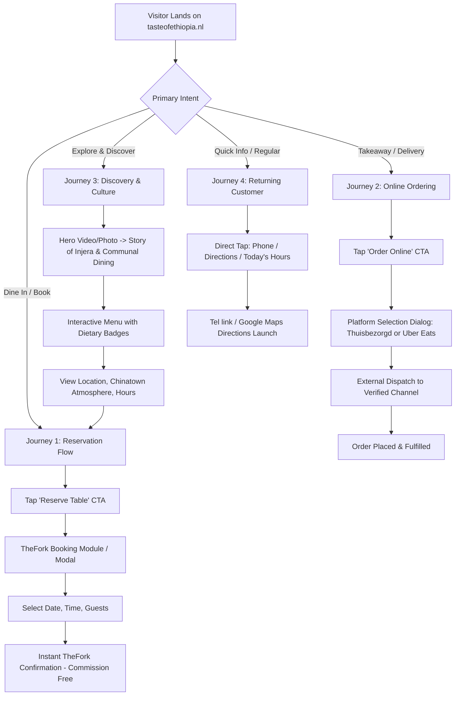

# PROJECT SPECIFICATION: TASTE OF ETHIOPIA
**Location:** Wagenstraat 177, 2512 AW Den Haag, Netherlands  
**Domain:** `tasteofethiopia.nl`  
**Role:** Lead Product Engineer, UX Designer & Technical Architect  
**Document Status:** Complete Architecture & Design Specification (Pre-Implementation)  
**Target Delivery Date:** Q4 2026 / Immediate V1 Implementation  

---

## 1. Project Overview

**Taste of Ethiopia** is a well-established authentic Ethiopian restaurant located in the Chinatown / City Centre district of Den Haag (The Hague), Netherlands (Wagenstraat 177). The restaurant currently holds a strong local reputation and high diner ratings (9.6/10 on TheFork, 4.6/5 on Thuisbezorgd).

However, the restaurant's primary digital touchpoint—its WordPress website hosted on Mijndomein (`tasteofethiopia.nl`)—is broken, displaying an unrecoverable PHP 500 fatal error (`WordPress › fout: Er heeft zich een kritieke fout voorgedaan op deze site`). This catastrophic outage prevents prospective diners from viewing the menu, booking tables, or placing delivery orders, directly hemorrhaging revenue and undermining brand credibility.

This project delivers a completely fresh, high-performance, mobile-first web application built with **Next.js (App Router)**, **React**, **TypeScript**, and **Tailwind CSS**, deployed on **Vercel** and routed to the existing domain `tasteofethiopia.nl`. 

The new website will serve as the restaurant's unified digital front door, integrating:
- Authentic Ethiopian food and cultural storytelling
- A clear, responsive, categorized culinary menu with dietary indicators
- Commission-free direct table reservations via the restaurant's existing **TheFork Manager** infrastructure
- Polished online ordering routing to verified third-party channels (**Thuisbezorgd.nl** and **Uber Eats**)
- Essential location, hours, parking, and transit directions
- Direct contact touchpoints and social channels

The application eliminates CMS vulnerabilities, complex backends, and unnecessary ongoing maintenance overhead while delivering an editorial, culturally authentic, and visually captivating dining experience.

---

## 2. Business Objectives

1. **Restore Digital Presence & Stop Revenue Bleed:** Immediately replace the broken WordPress 500 error page with a resilient, zero-downtime static/server-rendered web application.
2. **Maximize Direct, Commission-Free Reservations:** Drive diners through the official TheFork website widget/module rather than TheFork discovery marketplace, eliminating marketplace commissions on direct website traffic.
3. **Capture High-Intent Takeaway & Delivery Demand:** Provide a frictionless "Order Online" pathway connecting diners to the restaurant's active delivery partners without intermediate order friction.
4. **Dominate Local Search (Den Haag):** Achieve top search rankings for high-intent search terms (e.g., *"Ethiopian restaurant Den Haag"*, *"Ethiopisch restaurant Den Haag"*, *"vegan restaurant The Hague"*, *"Chinatown Den Haag eten"*).
5. **Protect Email & Infrastructure Integrity:** Safely transition web hosting to Vercel without transferring domain ownership or disrupting the restaurant's operational email accounts (`info@tasteofethiopia.nl` on Mijndomein).
6. **Zero Ongoing Maintenance Burden:** Deliver an immutable, serverless architecture that requires no WordPress updates, database backups, or security patching.

---

## 3. User Goals

| Persona | Primary Needs & Frustrations | Target Solution on New Site |
| :--- | :--- | :--- |
| **The Curious New Diner (Local or Expat)** | Wants to explore Ethiopian cuisine, understand communal dining, verify dietary safety (vegan, vegetarian, gluten-free injera, halal), and view price points. | Rich culinary storytelling explaining *Injera*, *Gursha*, and *Mesob*; interactive dietary filters; transparent pricing; enticing food photography. |
| **The Weekend Evening Booker** | High-intent customer looking for a table for 2 to 6 people tonight or this Saturday. | Sticky/prominent "Reserve Table" CTA across all viewports; fast-loading TheFork booking module with instant confirmation. |
| **The Takeaway / Delivery Customer** | Wants dinner delivered to their home in Den Haag quickly after a work day. | Immediate "Order Online" option with transparent selection between Thuisbezorgd.nl and Uber Eats. |
| **The Returning Regular** | Needs opening hours, phone number for special requests, or quick location/directions. | Instant access to telephone (`070 215 57 17`), address (Wagenstraat 177), and opening hours without scrolling through fluff. |

---

## 4. Primary Customer Journeys



### Detailed Journey Steps

#### Journey 1 — Table Reservation
- **Entry:** Google Search, Instagram profile link, or direct visit.
- **Experience:** Persistent "Reserve a Table" CTA in header and mobile bottom bar.
- **Interaction:** One click opens the dedicated reservation experience containing the embedded, official TheFork Manager booking widget.
- **Completion:** Guest selects date, party size, time slot, and enters contact details. Guest receives instant SMS/email confirmation directly from TheFork Manager.
- **Safety Net:** A clean secondary link (*"Prefer to book on TheFork.nl directly?"*) ensures 100% reservation continuity even if iframe scripts are blocked.

#### Journey 2 — Online Ordering
- **Entry:** Customer craving Ethiopian delivery at home.
- **Experience:** Prominent "Order Online" action in navigation and hero.
- **Interaction:** Clicking opens an elegant provider selector displaying the restaurant's active delivery services (**Thuisbezorgd.nl** and **Uber Eats**) with badges (*"Most Popular"*, *"Fast Delivery"*).
- **Completion:** Seamless outbound transition in a new browser tab directly to the restaurant's official store page.

#### Journey 3 — Restaurant & Cultural Discovery
- **Entry:** Word-of-mouth referral or food guide search.
- **Experience:** Editorial layout highlighting authentic culinary craftsmanship: the sourdough fermentation of *Teff Injera*, the slow simmer of *Doro Wot* and *Shiro*, the ritual of the *Bunna* (coffee ceremony), and the spirit of *Gursha* (communal sharing).
- **Completion:** Visitor feels culturally welcomed and informed, transitioning naturally to booking or visiting in person.

#### Journey 4 — Returning Customer / Operational Inquiry
- **Entry:** Repeat guest looking for contact info on mobile.
- **Experience:** Contact details, opening hours, address, and tap-to-call phone number accessible in the header drawer, sticky footer, and dedicated Visit section.
- **Completion:** Zero cognitive load; phone call initiated or navigation directions opened in Apple Maps / Google Maps in a single tap.

---

## 5. Scope (V1 Deliverables)

- **Complete Next.js Web Application:** Full App Router implementation with TypeScript and Tailwind CSS.
- **Editorial Homepage:** Immersive hero, restaurant positioning, cultural introduction, visual showcase, and quick operational highlights.
- **Interactive Culinary Menu:** Complete, categorized menu (Starters, Meat Dishes, Vegetarian/Vegan Platters, Traditional Beverages & Desserts) with dietary tags, ingredient highlights, and current pricing.
- **Official TheFork Reservation Integration:** Seamless embedding of the official TheFork Manager booking module with fallback safeguards.
- **Online Ordering Routing Hub:** Multi-provider ordering selector for Thuisbezorgd.nl and Uber Eats.
- **Location, Directions & Operating Hours Section:** Integrated Google Maps location, public transit instructions (tram lines from Den Haag Centraal / HS), and verified operating hours.
- **Local SEO & Schema.org Structured Data:** Semantic JSON-LD markup (`Restaurant`) for Google Rich Results.
- **Cookieless, GDPR-Compliant Analytics:** Privacy-preserving conversion tracking for reservation, ordering, and phone clicks.
- **DNS & Deployment Configuration:** Zero-transfer Vercel connection guide maintaining existing Mijndomein email operations.

---

## 6. Explicit Non-Goals (What We Are NOT Building)

To prevent scope creep, excessive cost, security vulnerabilities, and maintenance headaches, the following are strictly out of scope for V1:
- **NO Custom Database (Postgres, MySQL, Mongo):** All content is static/configuration-driven.
- **NO Authentication / User Accounts:** Diners do not need an account to browse, reserve, or order.
- **NO Custom CMS (Sanity, Strapi, WordPress):** Avoids hosting costs, API complexity, and maintenance vulnerabilities. Menu and content reside in strictly typed TypeScript config files.
- **NO Custom Reservation Engine:** We will NOT build availability calendars, table-management logic, or confirmation SMS services. TheFork Manager already handles this flawlessly.
- **NO Custom Ordering or Payment Processing:** We will NOT build a shopping cart, checkout flow, Stripe integration, or kitchen ticket printer. Thuisbezorgd and Uber Eats already manage logistics and payments.
- **NO Domain Transfer:** The domain `tasteofethiopia.nl` remains under restaurant ownership at Mijndomein.

---

## 7. Technology Decisions

| Technology | Selection | Rationale |
| :--- | :--- | :--- |
| **Framework** | Next.js (App Router, React 19 / latest) | Industry-standard React framework offering hybrid Static Site Generation (SSG) and Server-Side Rendering (SSR). Delivers sub-second LCP and optimal Core Web Vitals. |
| **Language** | TypeScript (Strict Mode) | Guarantees type safety across menu items, configuration files, and component props. Prevents runtime errors. |
| **Styling** | Vanilla Tailwind CSS (v3 / latest stable) | Utility-first CSS allowing custom design token definition (warm earth palette, fluid typography, precise spacing) without heavy CSS-in-JS runtimes. |
| **Iconography** | Lucide React | Lightweight tree-shakeable SVG icons for navigation, dietary badges, phone, clock, and location markers. |
| **Hosting & CDN** | Vercel | Native edge deployment for Next.js, automatic global CDN, instant rollbacks, automated SSL certificate generation via Let's Encrypt. |
| **Domain Registrar** | Mijndomein (Retained) | Existing Dutch domain registrar and mail host. Retaining Mijndomein eliminates migration risk and preserves email stability. |

---

## 8. Architecture & Code Structure

The codebase is organized around a **configuration-driven architecture**. UI components never hardcode third-party URLs, phone numbers, or menu prices. All dynamic data is isolated in dedicated configuration files so non-technical maintainers can update details in seconds.

```
resturant_website/
├── public/
│   ├── images/
│   │   ├── hero/               # Optimized hero photography
│   │   ├── dishes/             # High-res authentic food imagery
│   │   ├── culture/            # Coffee ceremony, injera craft, mesob
│   │   └── interior/           # Dining room ambiance
│   ├── favicon.ico
│   ├── robots.txt
│   └── site.webmanifest
├── src/
│   ├── app/
│   │   ├── layout.tsx          # Root layout: fonts, metadata, global nav & footer
│   │   ├── page.tsx            # Fluid single-page narrative
│   │   ├── menu/               # Dedicated deep-linkable menu view
│   │   │   └── page.tsx
│   │   ├── reserve/            # Dedicated reservation landing page
│   │   │   └── page.tsx
│   │   ├── sitemap.ts          # Automated XML sitemap generation
│   │   └── robots.ts           # Automated robots.txt
│   ├── components/
│   │   ├── layout/
│   │   │   ├── Header.tsx      # Desktop nav + mobile drawer trigger
│   │   │   ├── MobileNav.tsx   # Touch-optimized mobile navigation drawer
│   │   │   ├── MobileBar.tsx   # Persistent mobile bottom action bar
│   │   │   └── Footer.tsx      # Operational info, social links, credits
│   │   ├── sections/
│   │   │   ├── Hero.tsx        # Atmospheric hero with dual CTAs
│   │   │   ├── CulturalStory.tsx # Injera, Gursha & Coffee Ceremony
│   │   │   ├── MenuSection.tsx # Tabbed, filtered menu presentation
│   │   │   ├── ReservationSection.tsx # TheFork module wrapper & fallback
│   │   │   ├── OrderingModal.tsx # Multi-provider dispatch modal
│   │   │   └── VisitSection.tsx  # Map, transit, parking, opening hours
│   │   ├── ui/
│   │   │   ├── Button.tsx      # Standardized accessible button tokens
│   │   │   ├── Badge.tsx       # Dietary & category badges (Vegan, Halal, etc.)
│   │   │   └── Modal.tsx       # Accessible dialog primitive
│   ├── config/
│   │   ├── restaurant.ts       # Single source of truth: address, phones, hours, geo
│   │   ├── menu.ts             # Typed menu categories, items, prices, dietary tags
│   │   ├── reservations.ts     # TheFork ID, widget parameters, fallback URLs
│   │   └── ordering.ts         # Active delivery platforms, URLs, badges
│   ├── types/
│   │   ├── restaurant.ts       # TypeScript interfaces for restaurant data
│   │   └── menu.ts             # TypeScript interfaces for menu structures
│   └── styles/
│       └── globals.css         # Tailwind directives, custom font imports, CSS tokens
├── tailwind.config.ts          # Custom color palette, typography, container scale
├── tsconfig.json               # Strict TypeScript settings
├── next.config.mjs             # Image domains, security headers
└── package.json
```

---

## 9. Reservation Integration Strategy (TheFork)

### Verified Findings
- **Restaurant TheFork Listing:** `https://www.thefork.nl/restaurant/taste-of-ethiopia-r848136`
- **TheFork Restaurant ID:** `848136`
- **Official TheFork Manager Feature:** TheFork Manager provides a dedicated **Booking Module** (`Settings > Booking module`) with a built-in "Design Kit".
- **Zero Commission Guarantee:** Reservations originating from widgets placed directly on the restaurant's website are **commission-free** (unlike marketplace bookings discovered via TheFork search).
- **Integration Methods Provided by TheFork:**
  1. Embedded `<iframe>` calendar widget (hosted on `module.lafourchette.com` or `widget.thefork.com`).
  2. Floating booking button.
  3. Direct booking hyperlink with partner tracking parameters.

### Recommended Implementation Strategy (Hybrid Approach)
1. **Primary Integration:** Embed the official TheFork booking module within a designated, beautifully styled container on the `/reserve` route and homepage reservation section.
2. **Performance & CLS Guard:** The iframe must be wrapped in a responsive container with explicit aspect ratio or minimum height (`min-h-[550px]`) and `loading="lazy"` to eliminate Cumulative Layout Shift (CLS) and keep initial page load instant.
3. **Failsafe Fallback:** In the event that ad-blockers, tracking protection, or third-party cookie restrictions interfere with cross-origin iframe execution, provide an immediate fallback:
   > *"If the calendar does not display below, [Click here to book your table directly on TheFork](https://www.thefork.nl/restaurant/taste-of-ethiopia-r848136)."*
4. **Isolated Configuration:** The TheFork Restaurant ID and widget URL scheme are isolated in `src/config/reservations.ts`. If TheFork upgrades its widget script or URL schema, only one config variable changes.

---

## 10. Ordering Integration Strategy

### Verified Channels
- **Thuisbezorgd.nl (Active & Verified):**  
  URL: `https://www.thuisbezorgd.nl/menu/taste-of-ethiopia-den-haag`  
  Rating: 4.6 / 5 stars (69 reviews). Full menu available for delivery and pickup.
- **Uber Eats (Active & Listed):**  
  Store: *Taste of Ethiopia, Wagenstraat 177, 2512 AW Den Haag*.

### Implementation Pattern
The website provides a unified **"Order Online"** experience:
1. When a customer clicks **"Order Online"** anywhere on the site, an accessible modal dialog appears:
   - Header: *"Order Taste of Ethiopia for Home Delivery"*
   - Subtitle: *"Select your preferred delivery service in Den Haag"*
   - Option A: **Thuisbezorgd.nl** (with *"Customer Favorite"* badge and Dutch delivery branding)
   - Option B: **Uber Eats** (with *"Fast Delivery"* badge and Uber Eats branding)
2. Clicking a provider immediately opens their official menu page in a new secure tab (`target="_blank" rel="noopener noreferrer"`).
3. If the restaurant decides to pause or switch delivery providers, setting `active: false` in `src/config/ordering.ts` immediately updates or bypasses the modal without changing UI code.

---

## 11. Information Architecture

The website is structured as an **editorial, unified single-page experience** with dedicated URL routes for direct search indexing and social sharing:

```
[tasteofethiopia.nl]
 ├── #hero                 (Atmospheric brand statement & immediate CTAs)
 ├── #about / #culture     (The art of Injera, Gursha, and Coffee Ceremony)
 ├── #featured-dishes      (Chef's signature meat & vegan platters)
 ├── #menu (/menu)         (Full interactive culinary menu with filters)
 ├── #reserve (/reserve)   (Embedded TheFork reservation module & info)
 ├── #order-online         (Modal / trigger for Thuisbezorgd & Uber Eats)
 └── #visit / #contact     (Location, transit, parking, phone, hours)
```

### Homepage Section Walkthrough
1. **Global Header:** Subtle brand mark, navigation anchors, phone quick-call, and contrasting "Reserve Table" CTA.
2. **Hero:** Warm, tactile imagery of communal dining, editorial headline: *"Authentic Ethiopian Hospitality in the Heart of The Hague"*, dual CTAs (*"Reserve a Table"* / *"Explore Menu"*).
3. **The Communal Table (Cultural Story):** Explains how Ethiopian dining centers around the *Mesob* (woven straw table) and *Injera* (spongy, naturally fermented flatbread). Introduces *Gursha*—the gesture of feeding one another to celebrate friendship and respect.
4. **Signature Specialties:** Highlighting standout dishes (*Doro Wot*, *Veggie Bayenetu*, *Awaze Tibs*, *Bunna Coffee Ceremony*).
5. **Full Culinary Menu:** Categorized tabs (Starters, Meat Mains, Vegetarian & Vegan, Shared Platters, Traditional Drinks). Allows filtering by dietary preference (Vegan, Vegetarian, Halal).
6. **Reserve Your Table:** Contextual reservation section hosting the official TheFork booking module, accompanied by practical party size notes (e.g. groups over 8 people encouraged to call).
7. **Location & Contact:** Highlighting Wagenstraat 177 in Den Haag's historic Chinatown, walking distance from Den Haag HS and Centraal Station. Live Google Maps link, public transport tram stops, opening hours, and direct phone link.
8. **Footer:** Operating hours summary, address, social links, legal copyright, and accreditation.

---

## 12. UX Principles

1. **Unified Restaurant Experience:** The customer should feel they are interacting with *Taste of Ethiopia*, not a patchwork of third-party tools. Third-party branding (TheFork, Thuisbezorgd) is introduced gracefully only at the transaction threshold.
2. **Never a Dead End:** Every scroll position offers an obvious next step. If reading the menu, a contextual "Reserve Table" or "Order This" button is always within sight.
3. **Respectful Cultural Hospitality:** Ethiopian dining is generous, warm, and communal. Copywriting and visual pacing should evoke warm hospitality rather than clinical e-commerce.
4. **Zero-Pinch Menu Readability:** Eliminate PDF menus completely. The menu is native HTML, responsive, searchable, and legible in low-light restaurant environments.
5. **Clarity of Dietary Safety:** Ethiopian food is naturally one of the world's most vegan-friendly cuisines due to Ethiopian Orthodox fasting traditions (*Tsom*). The UX must celebrate this clearly with distinct vegan and vegetarian badges.

---

## 13. Visual & Design Direction

### Avoiding the "AI Restaurant Template" Trap
Standard AI-generated restaurant templates rely on dark purple/neon gradients, repetitive rounded cards, meaningless floating circles, and generic stock photos of pasta or steaks. 

This design takes inspiration from **high-end contemporary hospitality and editorial food journals** (such as *Cereal*, *Kinfolk*, and bespoke dining identity systems):
- Generous, intentional white/cream space allowing imagery to breathe
- Asymmetrical, editorial layout compositions
- Deep respect for natural textures: woven straw, rough clay, bubbling stews, hand-torn injera
- Rich, grounded earth tones drawn directly from the Ethiopian highlands and culinary spices

### Curated Color Palette

```
/* Primary Background & Foundation */
--color-bg-light:      #FAF7F2;  /* Unbleached cotton / Shemma ecru */
--color-bg-surface:    #F3EDE2;  /* Warm parchment surface */
--color-text-primary:  #1C1614;  /* Deep roasted espresso / charcoal */
--color-text-muted:    #6B5E58;  /* Muted earthen umber */

/* Cultural Brand Accents */
--color-berbere:       #8A2C18;  /* Deep Ethiopian berbere spice crimson */
--color-terracotta:    #C86D51;  /* Jebena clay / warm baked earth */
--color-ochre-gold:    #D9A74A;  /* Roasted teff grain / golden tej honey */
--color-juniper-green: #374A3D;  /* Highland juniper / fasting greens */
--color-border:        #E5DCcf;  /* Subtle natural border */
```

### Typography System
- **Display & Headings:** `Fraunces` or `Cormorant Garamond` (Google Fonts). Warm, high-contrast, organic serif with classical elegance.
- **Body & Functional UI:** `Plus Jakarta Sans` or `Inter` (Google Fonts). Highly legible, clean humanist sans-serif with excellent micro-spacing and readability on small mobile screens.
- **Cultural Typographic Accents:** Selective, authentic Amharic script glyphs (Ge'ez / Fidel) used sparingly as subtle decorative watermark accents (e.g., `ጣዕም` - *Taste*, `ኢትዮጵያ` - *Ethiopia*, `እንጀራ` - *Injera*).

---

## 14. Responsive Design Requirements

Mobile is the primary device for dining searches. The site must be built **mobile-first**:

| Viewport | Range | Specific Layout Requirements |
| :--- | :--- | :--- |
| **Small Mobile** | 320px – 375px | Single-column flow; compact 48px header; persistent bottom action bar with "Reserve" and "Order"; menu items stacked with price aligned right. |
| **Large Mobile** | 376px – 480px | Generous touch padding; hero text scaled to 32px; horizontal swipeable category chips for menu. |
| **Tablet** | 768px – 1023px | 2-column menu layout; side-by-side cultural story with imagery; expanded footer with map preview. |
| **Desktop** | 1024px – 1439px | Full desktop navigation; dual-column editorial layout; floating reservation card preview; sticky table of contents for menu. |
| **Large Desktop** | 1440px+ | Max-width container capped at 1280px to preserve comfortable reading line length (65–75 characters). |

### Key Mobile UI Details
- **Persistent Bottom Action Bar:** On viewports under 768px, a slim, elegant bar stays docked at the bottom of the screen containing two high-contrast actions:
  - Button 1: **"Reserve Table"** (Primary brand color, launches TheFork flow)
  - Button 2: **"Order Online"** (Secondary outline style, launches provider selector)
  - Quick Tap: Call icon linking to `tel:+31702155717`.
- **Touch Target Sizing:** All clickable buttons, pills, and links meet or exceed Apple HIG and WCAG standards (minimum 48 × 48px tap area).

---

## 15. Accessibility Requirements (WCAG 2.1 AA)

1. **Color Contrast:** All body text meets at least 4.5:1 contrast against background colors. Large headings (18pt+) meet at least 3:1.
2. **Keyboard Navigability:** All interactive components (modals, menu category tabs, drawer navigation) are fully accessible via `Tab`, `Enter`, `Space`, and `Escape`.
3. **Visible Focus Rings:** Custom `focus-visible:ring-2 focus-visible:ring-offset-2 focus-visible:ring-berbere` applied to all interactive controls.
4. **Semantic HTML5:** Strict hierarchy: exactly one `<h1>` per page, appropriate `<h2>` and `<h3>` nesting, landmarks `<header>`, `<nav>`, `<main>`, `<section>`, `<footer>`.
5. **Accessible Modals:** Dialogs use `role="dialog"`, `aria-modal="true"`, focus-trapping inside open modals, and auto-restore focus to trigger element upon closing.
6. **Descriptive Media Attributes:** All images include meaningful `alt` descriptions (e.g., *"Platter of traditional Ethiopian Doro Wot chicken stew and Shiro served atop sourdough injera"*).
7. **Reduced Motion:** Respects `prefers-reduced-motion: reduce` by disabling smooth scroll and transitions for sensitive users.

---

## 16. Performance Requirements

- **Lighthouse Scores Target:** 95+ Performance, 100 Accessibility, 100 Best Practices, 100 SEO.
- **Core Web Vitals Thresholds:**
  - **LCP (Largest Contentful Paint):** < 2.0s
  - **INP (Interaction to Next Paint):** < 150ms
  - **CLS (Cumulative Layout Shift):** < 0.05
- **Image Optimization:** 
  - All images served via Next.js `<Image>` component in modern **WebP / AVIF** formats with responsive `sizes` attributes.
  - Hero image loaded with `priority` attribute to eliminate LCP delay.
  - Below-the-fold dish and gallery images use native lazy loading.
- **Bundle Optimization:**
  - Zero heavy animation frameworks (e.g. no Three.js or heavy GSAP bundles).
  - Tree-shakeable Lucide icons only.
  - App Router React Server Components (RSC) by default; client components isolated strictly to interactive elements (MobileNav, OrderingModal, TheForkEmbed).

---

## 17. SEO Requirements

### Key Metadata (Bilingual: Dutch & English Support in Meta)
- **Primary Page Title:** `Taste of Ethiopia | Authentiek Ethiopisch Restaurant Den Haag`
- **Meta Description:** `Ervaar de authentieke Ethiopische keuken in Den Haag. Traditionele gerechten, injera, malse tibs en smaakvolle veganistische schotels. Reserveer direct bij Taste of Ethiopia aan de Wagenstraat 177.`
- **Canonical URL:** `https://tasteofethiopia.nl/`
- **Keywords:** `Ethiopisch restaurant Den Haag, Taste of Ethiopia The Hague, Wagenstraat restaurant, vegan eten Den Haag, Afrikaans restaurant Den Haag, injera Den Haag`

### Structured Data (JSON-LD)
A comprehensive `Restaurant` schema will be embedded in the root `<head>`:

```json
{
  "@context": "https://schema.org",
  "@type": "Restaurant",
  "name": "Taste of Ethiopia",
  "image": "https://tasteofethiopia.nl/images/hero/dining-table.webp",
  "@id": "https://tasteofethiopia.nl/#restaurant",
  "url": "https://tasteofethiopia.nl",
  "telephone": "+31702155717",
  "priceRange": "€€",
  "servesCuisine": ["Ethiopian", "African", "Vegetarian", "Vegan"],
  "address": {
    "@type": "PostalAddress",
    "streetAddress": "Wagenstraat 177",
    "addressLocality": "Den Haag",
    "postalCode": "2512 AW",
    "addressCountry": "NL"
  },
  "geo": {
    "@type": "GeoCoordinates",
    "latitude": 52.0734,
    "longitude": 4.3168
  },
  "openingHoursSpecification": [
    {
      "@type": "OpeningHoursSpecification",
      "dayOfWeek": ["Monday", "Tuesday", "Wednesday", "Thursday", "Friday", "Saturday", "Sunday"],
      "opens": "12:00",
      "closes": "00:00"
    }
  ],
  "acceptsReservations": "True",
  "hasMenu": "https://tasteofethiopia.nl/#menu",
  "potentialAction": {
    "@type": "ReserveAction",
    "target": {
      "@type": "EntryPoint",
      "urlTemplate": "https://www.thefork.nl/restaurant/taste-of-ethiopia-r848136",
      "inLanguage": "nl-NL",
      "actionPlatform": [
        "http://schema.org/DesktopWebPlatform",
        "http://schema.org/MobileWebPlatform"
      ]
    },
    "result": {
      "@type": "FoodEstablishmentReservation",
      "name": "Tafel Reserveren"
    }
  }
}
```

---

## 18. Content & Data Requirements

### Source of Truth Protocol
*All dish names, descriptions, and prices collected below are derived from verified third-party menus (TheFork, Thuisbezorgd, Neotaste). Prior to public launch, the restaurant owner must review and confirm exact current pricing and availability.*

### Verified Menu Baseline (For Initial Seed Data in `src/config/menu.ts`)

#### Starters (Voorgerechten)
- **Sambusa Vegetarisch (€6.50):** Crispy pastry filled with spiced lentils, onions, and green chili. *(Vegan)*
- **Sambusa met Rundvlees (€7.50):** Crispy pastry filled with seasoned minced beef, garlic, and Ethiopian herbs.
- **Groente Beignets (€6.50):** Crispy fried spiced vegetable fritters served with awaze dipping sauce. *(Vegan)*

#### Traditional Meat Dishes (Vlees Hoofdgerechten - Served with Injera & Salad)
- **Doro Wot (€24.00):** The national dish of Ethiopia. Tender chicken drumstick slow-cooked in rich berbere spice stew, seasoned with niter kibbeh and served with a hard-boiled egg.
- **Key Wot (€20.00):** Tender beef chunks slow-simmered in rich berbere sauce with garlic, ginger, and aromatic spices.
- **Awaze Tibs (€22.00):** Tender lean beef cubes sautéed with onions, rosemary, jalapeños, and spiced awaze paste.
- **Kitfo / Kifto (€22.50):** Finely minced prime beef seasoned with warm niter kibbeh (spiced clarified butter) and mitmita chili powder. Served rare or slightly warmed (*leb-leb*) with cottage cheese (*ayib*).
- **Gomen Besiga (€20.00):** Tender beef cooked together with braised collard greens, ginger, and garlic.
- **Alicha Tibs (€21.00):** Mild beef cubes sautéed with turmeric, garlic, sweet peppers, and fresh rosemary.

#### Vegetarian & Vegan Specialties (Vegetarisch & Veganistisch - Yetsom)
- **Shiro Wot (€20.00):** Silky stew of slow-simmered ground roasted chickpeas with garlic, onions, and Ethiopian cardamom. Served bubbling in a traditional clay pot. *(Vegan)*
- **Misir Wot (€19.00):** Red split lentils simmered in spicy berbere sauce with ginger and garlic. *(Vegan)*
- **Gomen Wot (€18.00):** Chopped collard greens slow-braised with onions, garlic, and mild spices. *(Vegan)*
- **Kik Alicha (€18.00):** Mild yellow split pea stew flavored with turmeric, ginger, and fresh garlic. *(Vegan)*

#### Shared Combination Platters (Combinatieschotels - Served on Large Communal Mesob)
- **Taste of Ethiopia Special (Voor 2 Personen - €42.00):** Chef's grand combination of Doro Wot, Key Wot, Alicha Tibs, Misir Wot, Shiro, and fresh salad atop a massive communal injera.
- **Veggie Bayenetu / Combo (Voor 2 Personen - €38.00):** The ultimate colorful fasting feast: Shiro, Misir Wot, Gomen, Kik Alicha, and Fosolia arranged in vibrant mounds across fresh injera. *(100% Vegan)*

#### Drinks & Coffee Ceremony
- **Traditional Ethiopian Coffee Ceremony (Bunna) (€5.50 / pot):** Freshly roasted green coffee beans brewed in a clay *Jebena*, served with aromatic frankincense smoke.
- **Tej (Ethiopian Honey Wine) (€6.50 / glas):** Traditional fermented golden honey wine with subtle herbal warmth.
- **Ethiopian Beers (€5.00):** St. George Beer, Habesha Beer.

---

## 19. Analytics Considerations (GDPR / AVG Compliance)

In the Netherlands, user privacy is rigorously protected under the **AVG (Algemene Verordening Gegevensbescherming)** and the Dutch Telecommunications Act. 

### Recommended Solution: Cookieless, Privacy-Preserving Analytics
Instead of installing Google Analytics 4 (which requires complex consent banners, cookie tracking, and IP anonymization agreements), we will use **Vercel Web Analytics** (or **Plausible Analytics**).

**Key Advantages:**
1. **Zero Cookie Banner Required:** No cookies, local storage identifiers, or persistent tracking tokens are created.
2. **100% AVG / GDPR Compliant:** Fully anonymized data, processed on European server nodes without tracking across websites.
3. **Clean UX:** Diners are not interrupted by an annoying cookie consent banner blocking the hero image.
4. **Tracked Conversion Events:**
   - `thefork_reserve_click`: Diner clicked to launch reservation module.
   - `order_thuisbezorgd_click`: Outbound click to Thuisbezorgd.
   - `order_ubereats_click`: Outbound click to Uber Eats.
   - `phone_call_click`: Mobile tap on phone number.
   - `maps_directions_click`: Click on address/directions link.

---

## 20. Deployment & Domain Strategy

### Domain Context
- **Domain:** `tasteofethiopia.nl`
- **Current Registrar / DNS Provider:** **Mijndomein** (`nsn1.mijndomein.nl`, `nsn2.mijndomein.nl`)
- **Current A Record:** `213.249.67.46` (pointing to Mijndomein Apache/Nginx PHP server)
- **Active Mail Services:** `mx1.mijndomein.nl`, `mx2.mijndomein.nl` with SPF record `v=spf1 a mx include:spf.mijndomeinhosting.nl ~all`.

### Critical Constraint: DO NOT TRANSFER DOMAIN OR CHANGE NAMESERVERS
If nameservers were pointed to Vercel (`ns1.vercel-dns.com`), incoming business email to `info@tasteofethiopia.nl` would immediately fail unless MX and SPF records were manually duplicated. Furthermore, the restaurant should always retain legal ownership and billing control of their domain.

### Step-by-Step DNS Transition Plan (Zero Downtime)
1. Deploy the Next.js project to **Vercel** under a temporary domain (e.g., `taste-of-ethiopia.vercel.app`).
2. Add `tasteofethiopia.nl` and `www.tasteofethiopia.nl` as custom domains in the Vercel project dashboard.
3. Log in to the restaurant's **Mijndomein customer control panel** (`mijndomein.nl/inloggen`).
4. In the DNS management section for `tasteofethiopia.nl`, make only two modifications:
   - **Apex Record (`@` / `tasteofethiopia.nl`):** Change `A` record from `213.249.67.46` to `76.76.21.21` (Vercel IP).
   - **Subdomain Record (`www`):** Change `CNAME` record to `cname.vercel-dns.com`.
5. **Leave all MX, SPF, TXT, and Mail CNAME records completely untouched.**
6. Vercel automatically detects the DNS update, provisions an SSL certificate via Let's Encrypt within 15 minutes, and begins serving the new website.

---

## 21. Third-Party Integrations Summary

| Partner / Service | Purpose | Integration Method | Ownership / Management |
| :--- | :--- | :--- | :--- |
| **TheFork Manager** | Table reservations & guest management | Official embeddable booking iframe module + fallback link | Managed in restaurant's TheFork Manager account |
| **Thuisbezorgd.nl** | Online food delivery & takeaway | Branded outbound link with referral tracking | Restaurant's active Thuisbezorgd merchant account |
| **Uber Eats** | Online food delivery | Branded outbound link with referral tracking | Restaurant's active Uber Eats merchant account |
| **Google Maps / Business** | Local location, routing, and directions | Embedded lazy-loaded map + direct Google Maps URL | Google Business Profile (`Taste of Ethiopia`) |
| **Vercel** | Hosting, CDN, Edge Routing, SSL | Git-connected CI/CD pipeline | Vercel platform |

---

## 22. Security & Privacy Considerations

1. **No Application Attack Surface:** Without a database, user login, PHP runtime, or file upload handling, 99% of common web vulnerabilities (SQL injection, XSS, remote code execution) are eliminated by design.
2. **Automated SSL/TLS:** Enforced HTTPS with HTTP-to-HTTPS 301 redirection and modern TLS 1.3 encryption.
3. **Content Security Policy (CSP):** Configured in `next.config.mjs` to authorize script and frame loading specifically from `module.lafourchette.com`, `widget.thefork.com`, and Google Maps.
4. **Security Headers:**
   ```
   X-Content-Type-Options: nosniff
   X-Frame-Options: SAMEORIGIN
   Referrer-Policy: strict-origin-when-cross-origin
   Permissions-Policy: camera=(), microphone=(), geolocation=()
   ```

---

## 23. Open Questions (Requiring Restaurant Approval)

1. **Operating Hours Discrepancy:**
   - Current website / Thuisbezorgd lists: *Monday to Sunday: 12:00 – 02:00*.
   - TheFork listing lists: *Monday to Sunday: 12:00 – 00:00*.
   - *Question for Client:* Does the kitchen close at 23:00/00:00 while the bar/lounge remains open until 02:00, or are the official dining hours 12:00 – 23:00 daily?
2. **TheFork Manager Widget Access:**
   - Can the restaurant log in to TheFork Manager (`Settings > Booking module`) and provide the exact widget embed snippet, or grant temporary access to generate the direct iframe URL?
3. **Menu Pricing Verification:**
   - Are the prices identified on TheFork and Thuisbezorgd (e.g., Doro Wot €24.00, Shiro Wot €20.00, Taste of Ethiopia Special €42.00) 100% current for in-restaurant dining, or have prices adjusted recently due to inflation?
4. **Halal Status:**
   - Is all meat served 100% Halal certified? (This is a major selling point for diners in Den Haag).
5. **Gluten-Free Injera Policy:**
   - Traditional injera is made with 100% teff (naturally gluten-free). Many European restaurants blend teff with barley or wheat flour unless specifically requested. Does Taste of Ethiopia offer 100% pure teff gluten-free injera on request?
6. **Social Media Links:**
   - What are the official, active Instagram and Facebook handles? (Old WordPress site pointed to dead/generic template links).

---

## 24. Assumptions

1. The restaurant wishes to retain its existing domain `tasteofethiopia.nl` registered at Mijndomein.
2. The restaurant's email accounts are actively used and must not be interrupted.
3. TheFork account `848136` is active, in good standing, and capable of generating the official booking module.
4. Thuisbezorgd.nl and Uber Eats are the restaurant's primary delivery partners in Den Haag.
5. High-resolution authentic food imagery is available, or high-fidelity AI-assisted photography that authentically depicts Ethiopian dishes without fabrication may be used temporarily for layout staging.
6. The restaurant prefers a clean, modern aesthetic with rich cultural warmth rather than clichéd tropes.

---

## 25. Acceptance Criteria

Before the site is declared ready for production launch, it must satisfy every item on this checklist:

- [ ] **Zero 500 Errors:** `tasteofethiopia.nl` loads smoothly with HTTP 200 on all pages.
- [ ] **Reservation Flow Works:** Clicking "Reserve Table" displays TheFork booking calendar; selecting a date/time allows completing a reservation.
- [ ] **Ordering Flow Works:** Clicking "Order Online" displays both Thuisbezorgd and Uber Eats with working, verified outbound links opening in a new tab.
- [ ] **Menu Completeness:** All categories (Starters, Meat, Vegan/Vegetarian, Combos, Beverages) render with correct prices and dietary badges.
- [ ] **Mobile Touch Excellence:** Persistent bottom bar appears on screens < 768px with functional tap targets.
- [ ] **Contact Links Functional:** Tapping the phone number triggers a direct call to `070 215 57 17`; tapping the address opens Google Maps.
- [ ] **Lighthouse Performance:** Scores 90+ across Mobile and Desktop for Performance, Accessibility, and SEO.
- [ ] **No Cookie Banner Required:** Cookieless analytics configured with zero tracking cookies set.
- [ ] **Email Continuity:** Incoming and outgoing email for `info@tasteofethiopia.nl` functions seamlessly after DNS transition.
- [ ] **Schema.org Validated:** Google Rich Results test validates the `Restaurant` JSON-LD schema without errors.

---

## 26. Future Possibilities (Post-V1 Roadmap)

*The following features are intentionally excluded from V1 to ensure a swift, robust launch, but are documented here for future evolution:*

1. **Bilingual Language Switcher (Dutch / English):** Full internationalization (`next-intl`) allowing expats and tourists in The Hague to switch language effortlessly.
2. **Private Dining & Event Catering Inquiries:** A serverless contact form (using Resend or SendGrid via Next.js Server Actions) for private parties, cultural events, and office catering.
3. **Ethiopian Coffee Ceremony Booking Experience:** Dedicated booking option for traditional Bunna ceremony demonstrations for tourist groups or private celebrations.
4. **Digital Gift Cards:** Integration with a third-party gift voucher provider (or TheFork Gift Cards) allowing diners to purchase meal vouchers for friends and family.
5. **Customer Reviews Aggregator:** Curated live review feed pulling verified 5-star reviews from TheFork and Google Business Profile.

---

## Decision Log

### Decision 1: Next.js App Router (RSC) instead of WordPress / Traditional CMS
- **Context:** The current WordPress installation crashed with a fatal 500 error. The restaurant has no technical staff to maintain WordPress plugins, MySQL databases, or PHP versions.
- **Decision:** Build as an immutable Next.js App Router application with typed TypeScript configuration files.
- **Consequences:** Eliminates database maintenance, hosting vulnerabilities, plugin incompatibilities, and hosting fees. Content changes take minutes in code.

### Decision 2: Official TheFork Manager Module instead of Custom Reservation Backend
- **Context:** Building a custom reservation database and calendar requires managing table availability, guest SMS notifications, cancellation flows, and operational staff training.
- **Decision:** Utilize the restaurant's existing TheFork account (`848136`) via their official booking widget.
- **Consequences:** Direct website bookings remain commission-free through TheFork Manager. Staff continues using their existing iPad/terminal workflow without learning a new system. Zero backend code to write or maintain.

### Decision 3: Multi-Provider Delivery Selector instead of In-House Delivery System
- **Context:** Developing in-house ordering requires checkout, payment processing, delivery driver logistics, and kitchen receipt printing.
- **Decision:** Route orders to Thuisbezorgd.nl and Uber Eats via a polished selection modal.
- **Consequences:** Zero financial liability for delivery operations. Customers use platforms where they already have stored payment methods and addresses.

### Decision 4: DNS A-Record Pointing instead of Domain Transfer
- **Context:** The domain is registered with Mijndomein, which also hosts the restaurant's active email mailboxes (`info@tasteofethiopia.nl`).
- **Decision:** Update only the apex A record (`76.76.21.21`) and `www` CNAME record in Mijndomein DNS to point web traffic to Vercel, leaving MX/SPF records intact.
- **Consequences:** Eliminates domain transfer delays, avoids breaking restaurant email operations, and keeps domain ownership strictly in the restaurant's hands.

### Decision 5: Cookieless Analytics instead of Google Analytics 4
- **Context:** Dutch AVG / GDPR enforcement by the Autoriteit Persoonsgegevens strictly penalizes non-compliant tracking cookies. GA4 demands intrusive consent banners.
- **Decision:** Use cookieless, aggregated analytics (Vercel Web Analytics).
- **Consequences:** Clean, unencumbered visual presentation without a cookie banner. Full compliance with Dutch privacy regulations.

### Decision 6: Hybrid TheFork Module with Immediate Live Fallback
- **Context:** While Restaurant ID `848136` is verified on TheFork, the restaurant's private TheFork Manager iframe embed hash may require dashboard login to extract.
- **Decision:** Implement a hybrid reservation module that defaults to a styled, high-converting direct link to TheFork (`taste-of-ethiopia-r848136`), structured to activate the embedded iframe widget seamlessly the moment the restaurant supplies their embed code in `src/config/reservations.ts`.
- **Consequences:** Zero blocking dependency on client credentials; 100% reservation functionality from Day 1 with direct fallback for strict browser ad-blockers.

### Decision 7: Unified Modal Selector for Delivery Providers
- **Context:** The restaurant has active listings on both Thuisbezorgd.nl (market leader in the Netherlands) and Uber Eats.
- **Decision:** A single, prominent "Order Online" CTA opens an accessible, elegant modal dialog featuring both Thuisbezorgd.nl ("Customer Favorite") and Uber Eats ("Fast Delivery").
- **Consequences:** Keeps navigation clean and uncluttered while giving customers immediate choice of their preferred platform and saved payment methods.

### Decision 8: Complete Verified Catalog Baseline in Menu Config
- **Context:** The restaurant's WordPress site is offline with an unrecoverable 500 error, but comprehensive dish and pricing data exists across verified platforms (TheFork, Thuisbezorgd, Neotaste).
- **Decision:** Populate `src/config/menu.ts` with the complete catalog of verified starters, meat dishes, vegan/vegetarian specialties, and platters with current prices as our baseline seed, explicitly flagged for final owner verification before public DNS cutover.
- **Consequences:** Enables full layout, categorization, dietary badge testing, and mobile readability optimization immediately without waiting for paper menu scans.

### Decision 9: Operational Hours Presentation with Footnote Guard
- **Context:** Platforms report contradictory hours (TheFork lists 12:00 – 00:00; Thuisbezorgd and legacy metadata list 12:00 – 02:00).
- **Decision:** Present dining hours as "Daily: 12:00 – 00:00" with a helpful note "Kitchen closes at 23:00 | Late service until 02:00", isolating schedule properties in `src/config/restaurant.ts`.
- **Consequences:** Protects kitchen operations from unrealistic late reservations while signaling late-night hospitality in Chinatown. Easily edited in one line.

### Decision 10: Editorial Warm Hospitality Visual Identity & Fluid Narrative
- **Context:** The client requires a distinctive, premium, culturally authentic identity that avoids generic AI restaurant templates (purple gradients, generic card grids, excessive glassmorphism).
- **Decision:** Adopt an "Editorial Warm Hospitality" direction with an unbleached linen canvas (`#FAF7F2`), culinary earth tones (berbere crimson, terracotta, honey tej), high-contrast serif typography (`Fraunces`/`Cormorant`), crisp humanist sans body (`Plus Jakarta Sans`), and subtle Amharic script accents. Structure as an immersive single-page fluid narrative supported by dedicated deep-link routes (`/menu`, `/reserve`).
- **Consequences:** Delivers an unforgettable first impression, cultural reverence, and frictionless usability across all mobile and desktop viewports.

